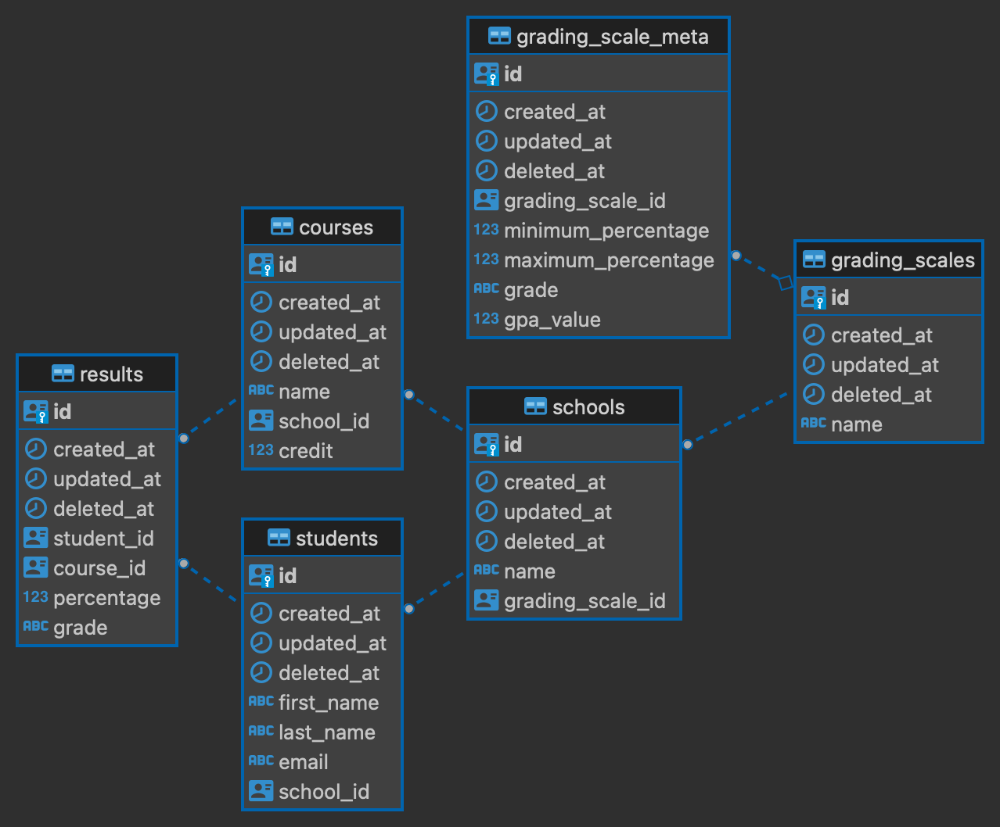

### Table of Contents
  - Project Folder Structure
  - Database Design
    - (Entity Relationship Diagram)
    - Assumptions
  - Setup (Without Docker-compose)
  - Setup (With Docker-compose)
  - Test
  - Note
  - Endpoints

---

# Folder Structure
  ```bash
├── digiexam-interview
│   ├── src
│   ├── controllers
│   ├── database
│   ├── models
│   ├── repositories
│   └── routes
│   └── services
├── pkg/postgres
├── README.md
├── Dockerfile
├── docker-compose.yml
├── digiexamdb-erd.png
├── go.mod
├── go.sum
└── .gitignore
```
  The name describes the files that each folder is supposed to contain.

# Database Design

## Entity Relationship Diagram



## Assumptions
In the process of designing the database, I made a presumption regarding the relationship between students and schools. Specifically, I presumed that a student's affiliation would be limited to a single school.

# Setup (Without Docker-compose)
- Create an .env file and supply the following environment variables
```sh
DB_HOST=XXXX
DB_USER=XXXX
DB_PASSWORD=XXXX
DB_NAME=XXXX
DB_PORT=XXXX
SERVER_HOST=XXXX
SERVER_PORT=XXXX
```
- Make sure go and its dependencies are installed on your local machine
- Run the following commands to start up the server 
 ```sh
go mod download
go run main.go
```
- The server can be accessed via http://localhost:8080
# Setup (With Docker-compose)
- Download the postgres docker image
```sh
docker pull postgres:14-bullseye
```

- Run the docker compose up to start up the app
 ```sh
docker compose up -d
```

- The server can be accessed via http://0.0.0.0:8080


# Test
- Run tests
```sh
go test -v ./... --cover
```

# Note
- Seeders: On First startup, the database is seeded with the data which is can be controlled on ```./main.go:25 ```, before start up, you can modify the parameter to controll the amount of fake data seeded.

# Endpoints


| Method   | URL                                      | Description                              |
| -------- | ---------------------------------------- | ---------------------------------------- |
| `GET`    | `/api/students/gpa?page=1&limit=10`                             | Retrieve all Students with their Result and Gpa.                      
